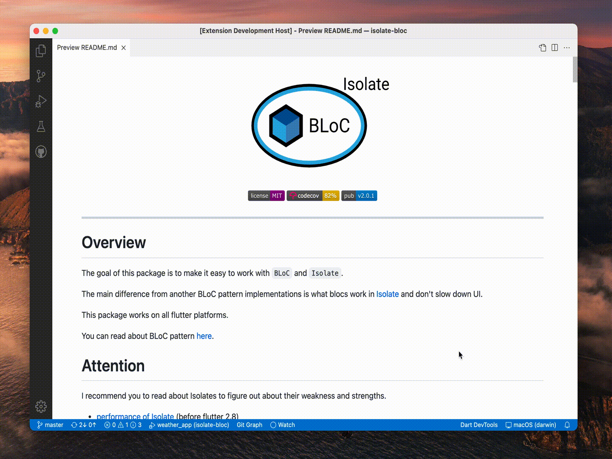
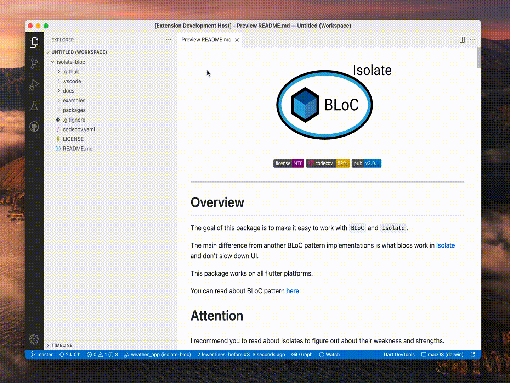

# DartPad

VS Code extension which allows you to use Dart Pad right in you current project. 
It opens dart file located outside of your project which you can edit, run and debug.

## Features

- Open Dart Pad with the command `Open Pure Dart Pad`
- Open Dart Pad in split view with the command `Open Pure Dart Pad in Split View`
- Open Dart Pad with installed packages with the command `Open Dart Pad`
- Open Dart Pad with installed packages in split view with the command `Open Dart Pad in Split View`

## Requirements

`dart` command should be available.

## Extension Settings

This extension contributes the following settings:

- `dartPad.dartPackages`: An array of packages which will be available in the Dart Pad. 
  Initial packages are `dio` and `uuid`

## Known Issues

`Open Dart Pad` and `Open Dart Pad in Split View` commands add `Dart Pad workspace` to your project. 
It is necessary for analyzer to "see" your packages and enable code completion for them.

However `Open Pure Dart Pad` and `Open Pure Dart Pad in Split View` just opens single file in you editor 
which you can run and in which you can use packages but without code completion.
